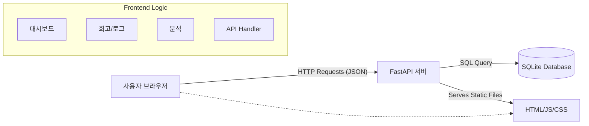

# 시스템 아키텍처 (System Architecture)

FlowTask는 가볍고 빠른 실행을 위해 Modern Web 기술 스택과 Python Backend를 결합한 단순하고 효율적인 구조를 따릅니다.

## 1. 전체 구조도 (Overview)

## 2. 구성 요소 상세

### A. Frontend (Client-Side)
-   **기술**: HTML5, CSS3, Vanilla JavaScript (ES6+ Modules)
-   **특징**:
    -   **No Build Tool**: 복잡한 번들링 과정 없이 브라우저의 Native Module(`import/export`) 시스템을 사용.
    -   **Modular Design**: `script.js`를 진입점으로 `api.js`, `auth.js`, `ui.js`, `dashboard.js` 등으로 기능별 모듈화.
    -   **Styling**: Pure CSS와 CSS Variables를 활용하여 테마 및 디자인 시스템 구축.

### B. Backend (Server-Side)
-   **기술**: Python 3.9+, FastAPI
-   **역할**:
    -   **Restful API**: `/users`, `/goals`, `/todos`, `/logs` 등 데이터 처리를 위한 엔드포인트 제공.
    -   **Static Serving**: `FastAPI.staticfiles`를 이용해 Frontend 정적 파일(`index.html` 등)을 직접 호스팅. 별도의 웹 서버(Nginx 등) 없이 배포 가능.
    -   **Data Validation**: Pydantic 모델을 사용하여 철저한 데이터 타입 검증.

### C. Database
-   **기술**: SQLite
-   **특징**:
    -   서버 로컬 파일(`flowtask.db`) 기반으로 설정이 간편함.
    -   **ORM**: SQLAlchemy를 사용하여 Python 객체와 DB 테이블을 매핑, SQL 작성 없이 데이터 조작.

## 3. 데이터 흐름 (Data Flow)
1.  **요청**: 사용자가 브라우저에서 '목표 추가' 버튼 클릭.
2.  **전송**: `dashboard.js` -> `api.js` -> `POST /goals` 요청 전송.
3.  **처리**: FastAPI 라우터가 요청 수신 -> Pydantic 스키마 검증 -> SQLAlchemy ORM으로 DB 저장.
4.  **응답**: 생성된 목표 데이터를 JSON으로 반환.
5.  **렌더링**: `dashboard.js`가 응답 데이터를 받아 DOM을 업데이트하여 화면에 표시.
